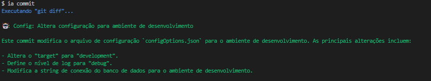

# 🤖 IA Terminal

CLI para automação de tarefas com IA, como geração de mensagens de commit utilizando inteligência artificial.

## Demostração do comando "ia commit"


# Sumário:
1. [Instalação](#instalação)
   - Clone o repositório
   - Instale as dependências
   - Compile o projeto e adicione o CLI ao sistema
2. [Configuração da variável IA_API_KEY](#configuração-da-variável-ia_api_key)
   - Obtenha sua chave de API
   - Configure a chave com o comando `ia set-key`
3. [Uso](#uso)
   - Gerar mensagem de commit com `ia commit`
4. [Contribuição](#contribuição)


## 🧰 Instalação

1. Clone o repositório:
```bash
git clone <URL_DO_REPOSITORIO>
cd ia-terminal
```

2. Instale as dependências:
```bash
npm install
```

3. Compile o projeto e Adicione o CLI ao seu sistema:
```bash
npm run build && npm link --force
```

Agora você pode usar o comando ia no terminal.

## Configuração da variável IA_API_KEY
Para utilizar a IA, é necessário configurar a chave da API. Siga os passos abaixo:

1. Gere uma chave da API Gemini [(clique aqui)](https://aistudio.google.com/apikey?hl=pt-br).
2. Configure a chave utilizando o comando:
```bash
ia set-key <SUA_CHAVE_API>
```

## Uso
Gerar mensagem de commit
Para gerar uma mensagem de commit com base nas alterações do Git, utilize:
```bash
ia commit
```

O comando executará git diff e usará a IA para gerar uma mensagem de commit em português.

## 🤝 Contribuição
Sinta-se à vontade para abrir issues ou enviar pull requests para melhorias no projeto.